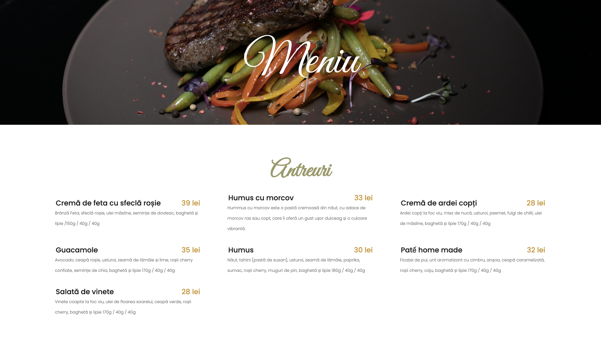

<p align="center"><a href="public/favicon.ico" target="_blank"></a></p>

## Krud Restaurant

Krud Restaurant is an interactive CRUD application for a restaurant in Iasi, Romania.


## The project includes:

- CRUD functionality: Ability to add, view, update, and delete product information.
- Adaptation: Full adaptation from the 1920px to the 360px.
- Livrare and Menu page: CRUD selection from the database that shows all products and categories.
- Shopping Cart: Functions to add, view, update, and delete products from the cart.
- Checkout: Form for checkout which add oreder info in database.
- API: API for showing location from OpenStreetMap.


## Installation

1. Clone the repository:
    ```
      git clone https://github.com/username/repository.git
    ```
2. Go to the project directory:
    ```
      cd repository
    ```
3. Install Composer:
    ```
        composer install
    ```
3. Setting up the .env file:
    ```
        cp .env.example .env
    ```
3. Running Migrations:
    ```
        php artisan migrate
    ```
3. Starting the server:
    ```
        php artisan serve
    ```
    

## Technologies

- HTML
- CSS
- JavaScript
- PHP
- Laravel
- mySQL
- Git
- OpenStreetMap API


## Screenshots
<p align="center">
    
    
    
    
    
    
    
            
    
    
    
    
    
    
    
    
    
            
    
    
    
    
</p>
